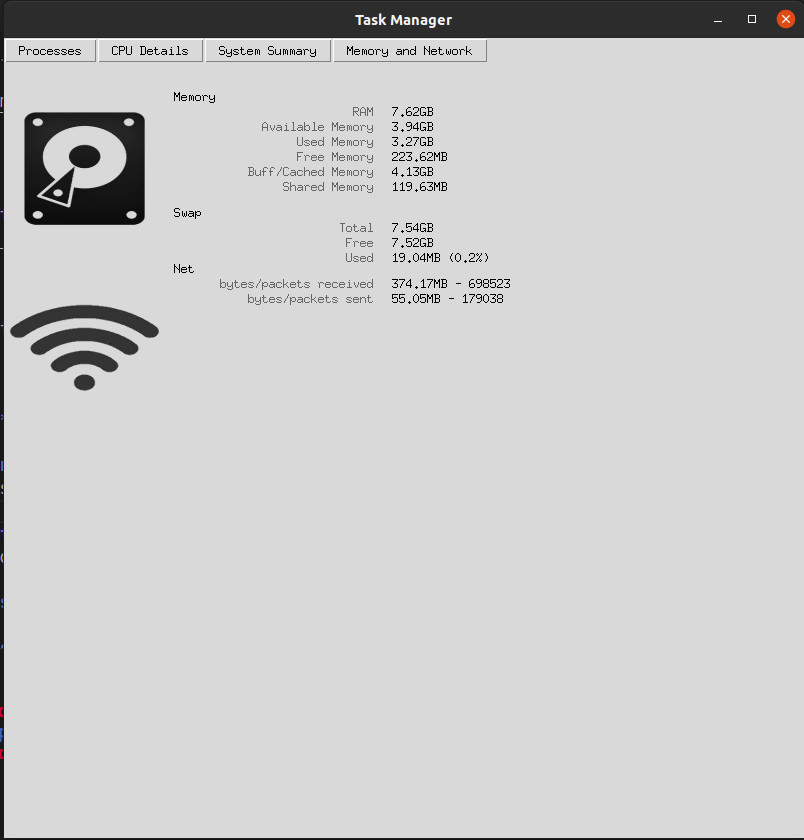

# Power and Process Monitor
Project for Algorithm and Operating Systems Course Monsoon 2021

**Team 5** :
- Siddharth De (2018102013)
- Manav Bhatia (2018102009)
- Eshan Gupta (2019102044)
- Chirag Shameek Sahu (2019102006)


## Overview

A task manager is a system monitor program used to provide information about the processes and applications running on a computer, as well as the general status of the computer. 
The motivation that led to working on this project was the absence of a ‘Task Manager’ in Linux based Operating Systems.


## Goals

We present the necessary details that are shown similarly in a ‘Task Manager’, like processes and applications running in the device, memory used, etc. of the device (laptop or Personal Computer) the program is run on with the help of a Graphical User Interface (GUI).


## Features

- Application with the help of Graphical User Interface (GUI)
- Tracks the different processes taking place in the system at the time of running and their respective information. Also provides the option to refresh the data that has been shown and kill the process that the user wishes.
- Performance that shows the utilization of CPU and RAM in the form of animated charts
- Provides the system details of the device
- Provides details of Memory and Network connectivity of the device

## Requirements

The project is based on the language Python 3.7.

The libraries used in this project are:
- **numpy** : It is a fundamental package for scientific computing in Python
- **matplotlib** : It is a cross-platform, data visualization and graphical plotting library for Python
- **psutil** : It is a cross-platform library for retrieving information on running processes and system utilization (CPU, memory, disks, network, sensors) in Python. It is useful mainly for system monitoring, profiling and limiting process resources and management of running processes.
- **pyRAPL** : It is a software toolkit to measure the energy footprint of a host machine along the execution of a piece of Python code. 
- **pandas** : It is a fast, powerful, flexible and easy to use open source data analysis and manipulation tool
- **distro** : provides information about the OS distribution it runs on, such as a reliable machine-readable ID, or version information
- **tkinter** : This is the standard GUI library for Python. It provides a powerful object-oriented interface to the Tk GUI toolkit.

We have put all the libraries along with their required versions in a requirements.txt file. The installation for tkinter may vary for different users. To install the requirements, there are two ways that we can install the required libraries :
1. If you are using pip, then we can type a command on our terminal inside the virtual env/ directory as
```
$ pip install -r requirements.txt
```
And for installing tkinter
```
$ sudo apt-get install python3-tk
```
2. If you are using conda for your python, then activate your project environment, open terminal, go inside required directory and type
```
$ conda install --file requirements.txt
```
And for installing tkinter
```
$ conda install -c anaconda tk
```

Also pyRAPL libraries provide some issues with permissions, so we have to provide access and read permissions to the intel-rapl folder so that the library can run properly. To do that, in your project directory, type the following command in your terminal - 
```
$ sudo chmod -R a+r /sys/class/powercap/intel-rapl
```
This provides access and read permission to the intel-rapl folder, allowing the pyRAPL library to work properly.


## Important Python Files

The project has 3 important python files that enable the working.

### main.py
This is the file that runs continuously until stopped explicitly by the user. Here we define the window which acts as a Graphical User Interface (GUI). This window presents us with the interface of our project.

### utilities.py
This file creates the utility functions of the project like  getting the complete information of the processes in the ‘Process Manager’ tab or animations that will take place in the ‘Usage Charts’ tab.

### cust_GUI.py
This is the program where the Graphical User Interface (GUI) is defined. Different tabs present in the interface are defined as classes. Each class has multiple functions defined to do their respective tasks that is to present the interface and perform associated tasks of the buttons.


## Running the project

In the src directory of the repo, run
```
$ python3 main.py
```

## Working of the Project

The task manager has 4 tabs. Each tab shows specific details as mentioned on the tab buttons. The 4 tabs are:
- Process Manager
- CPU Details
- System Summary
- Memory and Network Details

### Process Manager

This tab shows the details of all the processes taking place in the device where the code is run. 


The details present in table are 

- **Process ID (PID)** :
    Process identifier is a number used by most operating system kernels to uniquely identify an active process.
- **Name** :
    This is the name of the process that is running in the device.
- **CPU Usage (in %)** :
    CPU utilization refers to a computer's usage of processing resources, or the amount of work handled by a CPU. Actual CPU utilization varies depending on the amount and type of managed computing tasks. Certain tasks require heavy CPU time, while others require less because of non-CPU resource requirements.
- **Status**: 
    This shows the status of the process at the time it was displayed. The status can be either “running”, “paused”, “start_pending”, “pause_pending”, “continue_pending”, “stop_pending” or “stopped”.
- **Memory Used**:
    This tells us the total amount of virtual memory used by the process. If the access to the information was denied, it shows 0 bytes used.
- **Wait Bound**:
    If the process is in ‘idle’ state, we check whether the status is in input/output wait or in CPU wait. Else there is no information available about it and we show N/A. 
- **Power Consumption (in UJ)**:
    The Power consumption is calculated by the pyRAPL library which works with the psutil library such that we can measure the process power when we are deriving all its other characteristics. There is a meter characteristic in the library which allows us to calculate the power consumed by the process for the duration it was running.


There are also 2 buttons in the tab that provide the following utilities: 
1. **Refresh Button** : It is used to re-render the Data Frame that is being displayed in the GUI, that is, if any new processes have been started in the time the Data Frame was previously displayed and before it starts a re-render, the processes will be displayed on the Data Frame of the GUI.

2. **Kill Button** : The kill button provides the utility to kill a specific process running in the system by providing a specific PID of the process that has to be killed in the text box. If the proper PID exists, then the process with that PID will be killed, else we will encounter an error that the given PID does not exist. The user is also asked to confirm whether he would want to kill the process or not. Then the data frame is re-rendered to remove the valid process that has been killed.


### CPU Details

In this tab we monitor the current total CPU Usage and RAM Usage (in percentage). This is updated in real-time, with a history of CPU and RAM usage of the previous 25 seconds.


### System Summary

This tab provides the necessary details of the system the program is run on. The information presented are:


- **Username**

- **Node Name** : this is the name of the machine when present on a network

- **Distribution** : an operating system made from a software collection that is based upon the Linux kernel and, often, a package management system

- **Kernel Version** : a computer program at the core of a computer's operating system and has complete control over everything in the system

- **Desktop Environment** : implementation of the desktop metaphor made of a bundle of programs running on top of a computer operating system that share a common graphical user interface, sometimes described as a graphical shell

- **Instruction Set Architecture (ISA)** : abstract model of a computer that defines how the CPU is controlled by the software. Interface between the hardware and the software, specifying both what the processor is capable of doing as well as how it gets done

- **Central Processing Unit (CPU) aka Processor** : integrated electronic circuit that performs the calculations that run a computer

- **Graphics Processing Unit (GPU)** : specialized electronic circuit designed to rapidly manipulate and alter memory to accelerate the creation of images in a frame buffer intended for output to a display device

- **RAM** : the installed RAM space of the device

- **Swap Memory** : dedicated amount of hard drive that is used whenever RAM runs out of memory

- **Disk Size** : the amount of size allocated to the disk (here, it is the amount of space that was allocated for the partitioning done for LINUX)

- **Root Device** : the superuser account in Unix and Linux. It is a user account for administrative purposes, and typically has the highest access rights on the system.

- **Battery** : device’s battery (in percentage) when the code was run


### Memory and Network Details

This tab shows detailed information about the memory and the network details of the device.

Memory is the details about the RAM. This contains all the details like the installed memory present in the system (i.e., the original amount of RAM installed), the available memory, the used memory, free memory and shared memory. It also provides details about the Buffer/Cache memory of the system. 

Swap space is a space on a hard disk that is a substitute for physical memory. It is used as virtual memory which contains process memory images. Whenever our computer runs short of physical memory it uses its virtual memory and stores information in memory on disk. Swap space helps the computer’s operating system in pretending that it has more RAM than it actually has. It is also called a swap file. This interchange of data between virtual memory and real memory is called swapping and space on disk as “swap space”.

The Network details are provided below that. It provides details like the number of bytes/packets sent and received, and the network dropin and dropout values. All this data is available using Psutil’s io_counters function.


